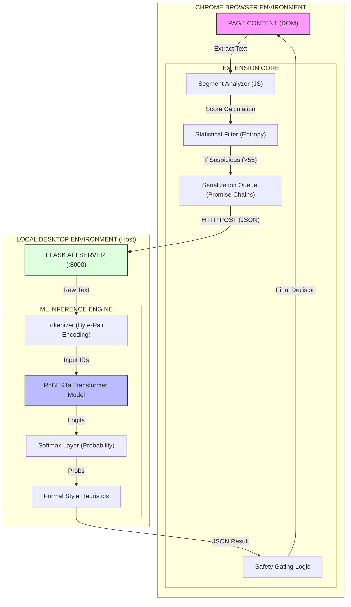

# ML Model: Architecture & Workflow Block Diagrams

This document provides visual **Block Diagrams** of the ShareSafe Machine Learning integration and a step-by-step explanation of the data flow.

---

## 1. System Block Diagram (High-Level Architecture)

This diagram shows the major logic blocks and how data moves between the Chrome Browser and the Local Python Desktop Environment.



### Architecture Description
1.  **Chrome Browser Environment**: Hosts the extension.
    *   **Segment Analyzer**: The "brain" that scans the page.
    *   **Statistical Filter**: First line of defense. Filters out obvious human text using math (entropy/burstiness) to save resources.
    *   **Serialization Queue**: Ensures technical stability by forcing requests to happen one-by-one.
2.  **Local Desktop Environment**: Hosts the Python process.
    *   **Flask API**: Listens for requests on localhost port 8000.
    *   **ML Inference Engine**: Contains the heavy AI logic (RoBERTa) that would otherwise crash a browser.

---

## 2. Workflow Block Diagram (Step-by-Step Execution)

This diagram visualizes the decision process from start to finish for a single piece of text.

```mermaid
graph TD
    START([Start: Text Segment Detected]) --> CHECK_WORDS{Word Count >= 120?}
    
    CHECK_WORDS -- No --> IGNORE([End: Skip ML])
    CHECK_WORDS -- Yes --> CHECK_STAT{Stat Score >= 55?}
    
    CHECK_STAT -- No --> IGNORE
    CHECK_STAT -- Yes --> QUEUE[Add to Request Queue]
    
    QUEUE --> FETCH[POST /detect to Localhost]
    
    subgraph "PYTHON BACKEND PROCESSING"
        FETCH --> TOKENIZE[Tokenize Text (Max 512)]
        TOKENIZE --> INFERENCE[RoBERTa Inference]
        INFERENCE --> LOGITS[Get Logits]
        LOGITS --> PROBS[Calculate Probabilities]
        PROBS --> FORMAL{Is Formal Style?}
        FORMAL -- Yes --> FLAG_FORMAL[Set is_formal = True]
        FORMAL -- No --> NO_FLAG[Set is_formal = False]
        FLAG_FORMAL --> RESPONSE[Return JSON]
        NO_FLAG --> RESPONSE
    end
    
    RESPONSE --> CHECK_RESULT{Analyze Result (JS)}
    
    CHECK_RESULT -- "Human Score >= 85" --> REDUCE[ACTION: Reduce AI Confidence]
    CHECK_RESULT -- "Formal Flagged" --> CAP[ACTION: Cap Confidence at 45%]
    CHECK_RESULT -- "AI Score High" --> NO_OP[ACTION: Ignore (Safety Rule)]
    CHECK_RESULT -- "Low Confidence" --> DISCARD[ACTION: Discard Result]
    
    REDUCE --> FINISH([End: Update UI])
    CAP --> FINISH
    NO_OP --> FINISH
    DISCARD --> FINISH
```

### Step-by-Step Walkthrough

#### **Step 1: Detection & Filtering (Browser Side)**
*   **Trigger**: The user scrolls to a new paragraph.
*   **Filter 1 (Length)**: Is the text long enough (>120 words)? If not, ML is unreliable -> **SKIP**.
*   **Filter 2 (Statistical)**: Is the text statistically "weird" (Score > 55)? If it looks normal (Human) -> **SKIP**. (This saves battery/CPU).

#### **Step 2: Queueing & Transport**
*   **Queue**: The request is added to `mlQueue`. It waits for any previous request to finish.
*   **Transport**: The extension sends a hidden HTTP POST request to the local Python server.

#### **Step 3: Backend Intelligence (Server Side)**
*   **Tokenization**: The text is broken into sub-word chunks (e.g., "detecting" -> "detect" + "ing").
*   **Inference**: The RoBERTa model predicts the likelihood of the text being AI-generated vs. Human-written.
*   **Formal Check**: The Python script calculates average word length. If it's high (>5.2 chars) and uses no "I/We" pronouns, it flags the text as "Formal Style" (potentially Wikipedia).

#### **Step 4: Safety Gating (Browser Side)**
The browser receives the result and applies strict rules:
*   **Scenario A (Verified Human)**: The model is 85%+ sure it's human.
    *   **Action**: We LOWER the original AI score. The user is exonerated.
*   **Scenario B (Formal Style)**: The model flagged it as formal/academic.
    *   **Action**: We CAP the confidence at 45%. We refuse to flag Wikipedia as AI with high confidence.
*   **Scenario C (AI Confirmation)**: The model thinks it's AI.
    *   **Action**: We **IGNORE** it. We never allow the secondary model to *badly* flag a user. It is only allowed to *help* them.

---

## 3. Why This Architecture?

1.  **Performance**: Browsers limit memory to ~4GB per tab. Loading a 500MB model would crash older computers. Running it in Python separates the memory usage.
2.  **Privacy**: The text never leaves your computer. It goes to `localhost` (127.0.0.1), processed completely offline.
3.  **Reliability**: By "Gating" the ML (only running it on suspicious text), we reduce false positives significantly compared to constant scanning.
